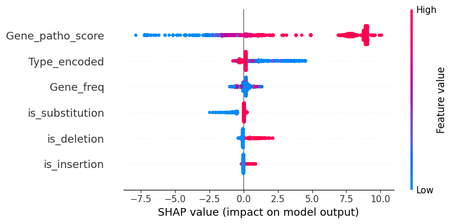

# Interpretable Variant Pathogenicity Prediction using ClinVar

This project builds an interpretable machine learning model to predict the pathogenicity of genetic variants using ClinVar data.

## Overview

- Model: XGBoost
- Task: Pathogenic vs Benign classification
- ROC-AUC: ~0.94

## Key Features

- Gene-level pathogenicity scoring (leakage-aware)
- Mutation type encoding
- Class imbalance handling
- SHAP-based explainability

## SHAP Explainability

## Tech Stack

Python | Pandas | Scikit-learn | XGBoost | SHAP  

## Project Structure

- `src/` → model code  
- `results/` → SHAP plot  
- `requirements.txt` → dependencies  

## Future Work

- Add conservation scores  
- Extend to VUS prediction  
- External validation  
